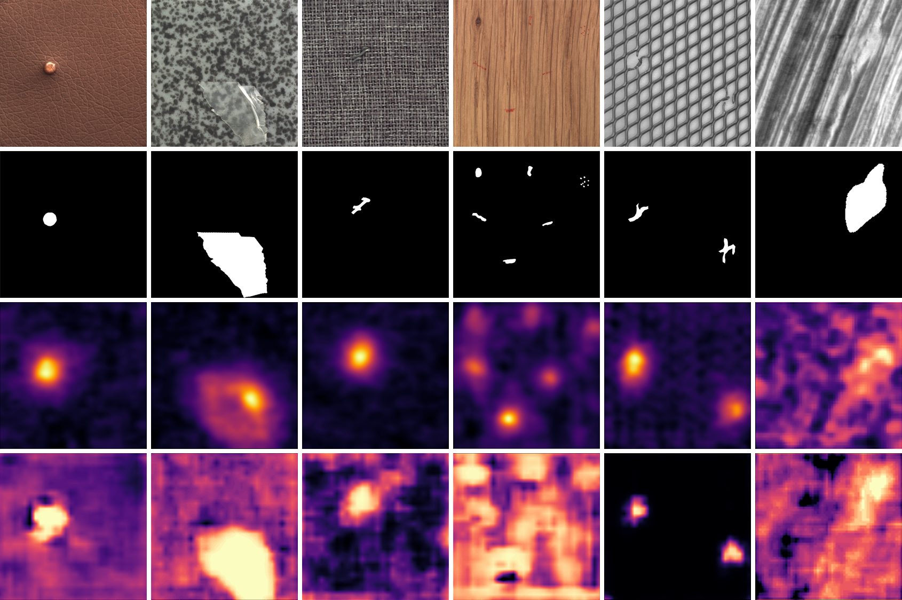

# AdalossCycleGAN: Adaptive Loss CycleGAN for Industrial Anomaly Detection
[](https://opensource.org/licenses/MIT)

## Discussion Link (CVPR-2025 Only)
https://www.kialo-edu.com/p/4c56a7b0-0abb-4900-a616-79385b6bfb2b/493759

## Abstract
Contemporary image-based industrial anomaly detection (IAD) techniques often struggle to identify anomalies within real-world images with complex textural patterns. State-of-the-art IAD methods such as SimpleNet are seldom validated using complex pattern datasets, with performance dropping significantly for industrial images exhibiting low mean entropy and high Gabor feature standard deviation. While CycleGAN demonstrates domain transfer potential, it lacks the sensitivity required for IAD. We introduce AdalossCycleGAN, which adaptively modifies CycleGAN's loss function to improve anomaly sensitivity while maintaining domain transfer capabilities. Experimental results show AdalossCycleGAN achieves 92.9% anomaly localization accuracy on our CBT dataset (surpassing SimpleNet's 89%), and consistently outperforms competitors on 30%+ of images across all benchmarks.

## Installation
```bash
# Clone repository
git clone https://github.com/yourusername/AdalossCycleGAN.git
cd AdalossCycleGAN

# PyTorch 1.8+ required
conda create -n adaloss python=3.8
conda activate adaloss
conda install pytorch=1.8 torchvision cudatoolkit=11.1 -c pytorch
pip install -r requirements.txt
```
- To view training results and loss plots, run `python -m visdom.server` and click the URL http://localhost:8097.
- To log training progress and test images to W&B dashboard, set the `--use_wandb` flag with train and test script
- Train a model:
```bash
#!./scripts/train_cyclegan.sh
python train.py --dataroot ./CBTD_dataset --name v1 --model cycle_gan
```
To see more intermediate results, check out `./checkpoints/maps_cyclegan/web/index.html`.
- Test the model:
```bash
#!./scripts/test_cyclegan.sh
python test.py --dataroot ./CBTD_dataset --name v1 --model cycle_gan
```
- The test results will be saved to a html file here: `./results/maps_cyclegan/latest_test/index.html`.

### Apply a pre-trained model (CycleGAN)
Checkpoints for the models and results mentioned in the paper are available in the Final Model Checkpoints folder.
Make sure you copy the model checkpoints you want to test into the checkpoints/adalosscyclegan_exp folder
- Then generate the results by inputting relevant dataset and experiment name arguments as shown below 
copy 
```bash
python test.py --dataroot ./CBTD_dataset --name adalosscyclegan_exp --model cycle_gan --epoch {if needed}
```

## Acknowledgments
Our code is inspired by [pytorch-DCGAN](https://github.com/pytorch/examples/tree/master/dcgan) and [pytorch-CycleGAN](https://github.com/junyanz/pytorch-CycleGAN-and-pix2pix).

## Key Results

### MVTec-AD Category Breakdown
| Category   | InTra       | SimpleNet   | GFT         | AdalossCycleGAN          |
|------------|-------------|-------------|-------------|--------------------------|
| Tile       | 0.982/0.944 | <span style="color:red">0.998</span>/**0.970** | -/0.935     | **1.0**/<span style="color:red">0.952<sub>±0.64</sub></span> |
| Wood       | <span style="color:red">0.975</span>/0.887 | **1.0**/**0.945** | -/0.908     | **1.0**/<span style="color:red">0.929<sub>±0.088</sub></span> |
| Grid       | **1.0**/**0.988** | <span style="color:red">0.997</span>/**0.988** | -/<span style="color:red">0.9318</span> | 0.966/0.788<sub>±0.196</sub> |
| Leather    | **1.0**/**0.995** | **1.0**/<span style="color:red">0.992</span> | -/0.984     | **1.0**/**0.995**<sub>±0.005</sub></span> |
| Carpet     | <span style="color:red">0.988</span>/**0.992** | **0.997**/<span style="color:red">0.982</span> | -/0.932     | 0.957/0.973<sub>±0.063</sub> |

*Bold indicates best performance, red indicates second best. Standard deviations shown for AdalossCycleGAN pixel-level results.*

### Qualitative Results
<div style="background-color: white; padding: 20px; border-radius: 10px; margin: 20px 0;">
  <figure style="text-align: center;">
    
    <figcaption style="margin-top: 15px; font-style: italic; color: black;">
      Qualitative comparison of anomaly localization on MVTec-AD (Bergmann et al., 2019) and CBTD datasets. From top to bottom: Reference normal sample, ground-truth mask, SimpleNet prediction, AdalossCycleGAN prediction.
    </figcaption>
  </figure>
</div>

## References
1. Zhu et al. (2017) CycleGAN [[Paper]](https://arxiv.org/abs/1703.10593)
2. Liu et al. (2023) SimpleNet [[Paper]](https://arxiv.org/abs/2301.04632)

## License
MIT Licensed. See [LICENSE](LICENSE) for details.

